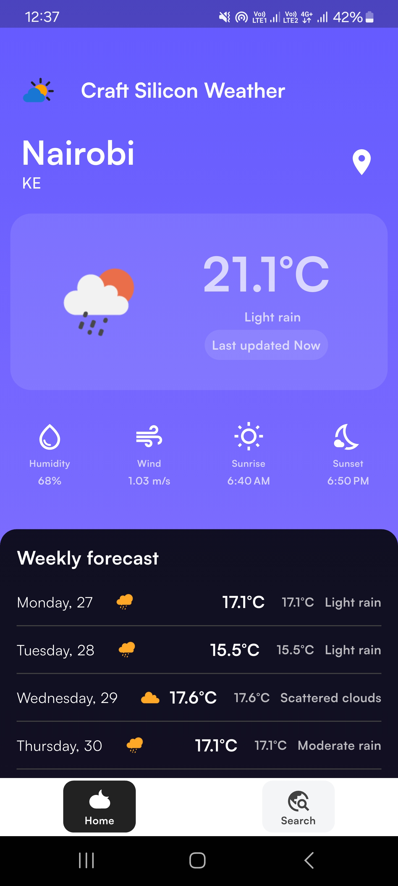
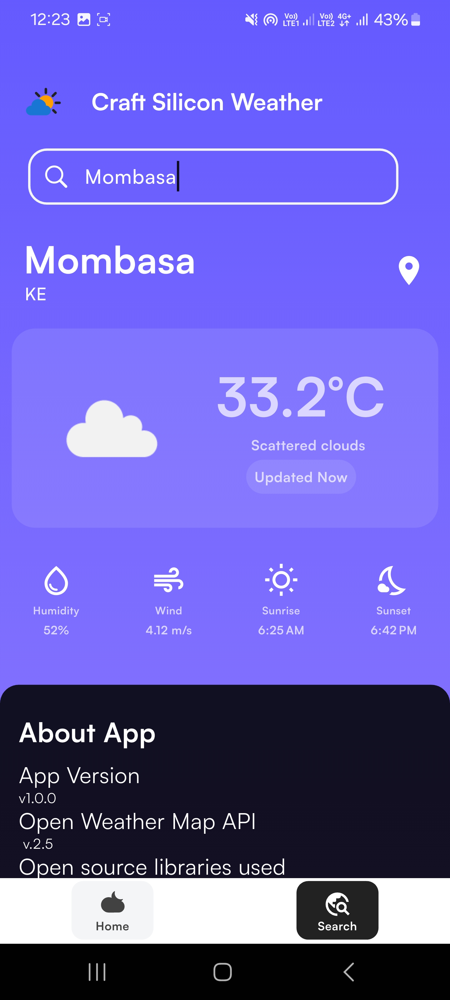
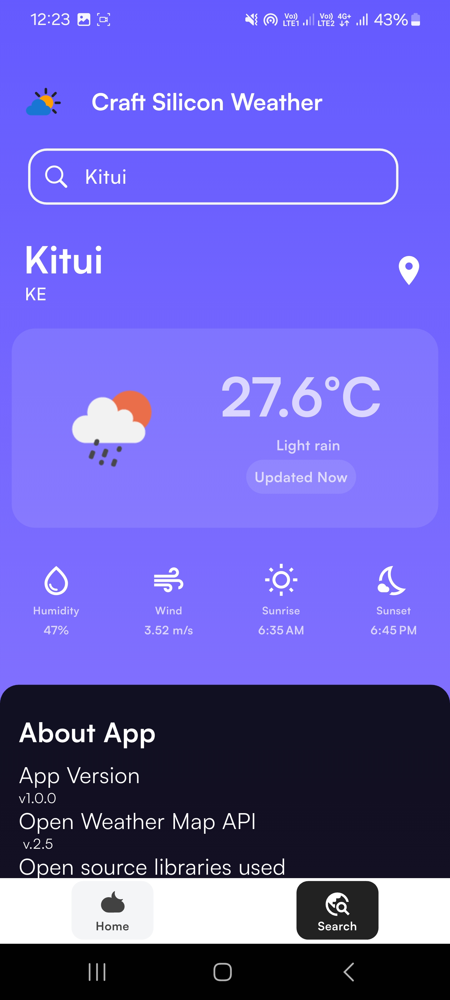

# Craft Silicon Weather App 🌤️  
A modern, mobile weather application that fetches and displays weather data from the OpenWeather API. Built with [Flutter](https://flutter.dev), this app provides current weather and a 5-day forecast for any city, with an elegant and user-friendly interface inspired by the latest UI/UX design standards.

---

[]([resources/Screen_Recording_20250127_122159.mov](https://github.com/bensalcie/craftsiliconweather/blob/main/resources/Screen_Recording_20250127_122159.mov))


## Features ✨  
- **Real-time Weather Data**: Displays current weather (temperature, wind speed, humidity) for the selected city.  
- **5-Day Forecast**: Provides a detailed daily forecast for the upcoming five days.  
- **City Search**: Allows users to search and view weather information for any city globally.  
- **Responsive Design**: Works seamlessly on different screen sizes.  
- **Modern UI/UX**: Sleek, gradient backgrounds, clean typography, and dynamic icons to enhance the experience.  
- **Offline Storage**: Caches data locally to allow offline access to previously fetched weather data.  
- **Error Handling**: Displays appropriate messages when data cannot be fetched (e.g., no internet).  

---

## Clean Architecture and State Management  
This app is built following **Clean Architecture** principles, ensuring separation of concerns and scalability. It uses **BLoC (Business Logic Component)** for state management, enabling reactive programming and improving maintainability.

---

## Installation and Setup 🛠️ 

## Quick Testing 
Download Sample apk [Here](https://github.com/bensalcie/craftsiliconweather/blob/main/resources/craftsilicontestapp.apk)


### Prerequisites  
Ensure the following are installed on your system:  
- [Flutter SDK](https://docs.flutter.dev/get-started/install) (v3.13 or later)  
- [Android Studio](https://developer.android.com/studio) or [Xcode](https://developer.apple.com/xcode/) (for iOS development)  
- OpenWeather API Key ([Sign up here](https://openweathermap.org/api))  

### Steps  
1. **Clone the Repository**:  
   ```bash  
   git clone https://github.com/bensalcie/craftsiliconweather.git 
   cd weather-app  
2. **Install Dependencies:**:  
   ```flutter pub get  
3. **Set Up API Key:**:  
   ```Create a file named .env /.dev.env in the root directory.
      Add your corresponding  Release/Debug OpenWeather API key in the following format:  
      BASE_URL=http://api.openweathermap.org/data/2.5/
      WEATHER_API_KEY=YOUR KEY HERE 
4. **Run the App:**:  
   ```For Android:
      flutter run
      For iOS:
      flutter run -d ios
5. **Run the App:**:  
    Folder Structure 🗂️
    The project follows Clean Architecture principles and organizes code into layers:
    ```
       lib/  
       ├── core/            # Shared resources (e.g., error handling, utilities)  
       │   ├── network/     # Network and API handling  
       │   └── theme/       # Application-wide themes and styles  
       ├── features/        # Feature-specific code  
       │   ├── weather/     # Weather-related functionality  
       │   │   ├── data/    # Data sources, models, and repositories  
       │   │   ├── domain/  # Business logic (use cases and entities)  
       │   │   └── presentation/  
       │   │       ├── bloc/      # Bloc files for state management  
       │   │       └── screens/   # UI screens (WeatherScreen, SearchScreen)  
       ├── main.dart        # Entry point of the app  
## Approach ✨  
  ### 1. Clean Architecture:
        Organized code into layers (Data, Domain, Presentation) to ensure separation of concerns and scalability.
        Used repositories in the Data layer to fetch weather data from the OpenWeather API.
        Implemented use cases in the Domain layer for business logic.
  ### 2. BLoC State Management:
        Leveraged flutter_bloc for state management, ensuring clean and reactive interactions between UI and business logic.
        Used events and states to handle data fetching, loading, and error scenarios effectively.
  ### 3. UI/UX Design:
        The UI is inspired by the modern mockup provided, ensuring a clean, gradient-based design and user-friendly interaction.
  ### 4. Offline Support:
        Cached responses using the shared_preferences package to allow users to access the last fetched data offline.
  ### 5.  Performance Optimization:
      Implemented efficient image caching using cached_network_image.
      Optimized state changes to minimize unnecessary widget rebuilds.

## Challenges Faced 🛠️  

1. **API Integration**:  
   - Handling API rate limits and ensuring smooth data fetching without delays.  
   - Solution: Implemented efficient caching and limited frequent calls to the API.  

2. **Clean Architecture Setup**:  
   - Structuring the app to adhere to Clean Architecture while maintaining code readability and simplicity.  
   - Solution: Carefully designed the folder structure and ensured proper separation of concerns.  

3. **State Management**:  
   - Implementing BLoC to manage UI states for data fetching, loading, and error handling without affecting app performance.  
   - Solution: Leveraged best practices with streams and events to handle complex states.  

4. **Offline Functionality**:  
   - Ensuring a seamless experience when there is no internet connection.  
   - Solution: Used `shared_preferences` and `hive` to store data locally and inform users about offline mode.  

5. **UI/UX Challenges**:  
   - Mimicking the modern UI theme with reusable widgets while maintaining performance.  
   - Solution: Carefully designed components with responsiveness and animation effects for better user experience.  


## How It Works ⚙️  

1. **Fetch Weather Data**:  
   - The app fetches current weather and 5-day forecast using the OpenWeather API when a city is searched or selected.  

2. **Display Data**:  
   - The main screen shows current weather, while the forecast screen lists future weather conditions.  

3. **Offline Access**:  
   - When offline, cached data is displayed with a message indicating it may not be up to date.  

---

## Screenshots 📸  
|                                      Location                                        |                                      Search                                       |                                       Location Details                                       |                                       About                                       |
|:-----------------------------------------------------------------------------------------:|:-------------------------------------------------------------------------------:|:---------------------------------------------------------------------------------------:|:----------------------------------------------------------------------------------------:|
|  |  |   |   |
---

## Future Improvements 🛠️  

1. Add support for multi-language weather descriptions.  
2. Implement user-defined themes (light and dark modes).  
3. Enhance offline storage to cache forecasts for multiple cities.  

---

## License 📝  
This project is licensed under the MIT License.  

---

## Contributions 🤝  
Contributions are welcome! Feel free to fork the repository and submit a pull request.  


